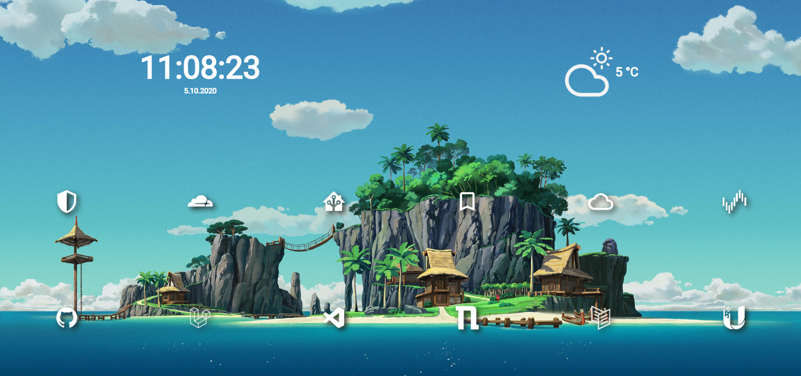

# Stargrid ✨
## Jumpstart your browsing experience! 🚀
 
Wallpaper credit to [Matt Vince](https://www.mattvince.com/)
---

## Features:
- Replaces Chrome's new tab
- Clock with current date
- Weather for one static location
- 12 quick-links you can customize

---

## How can I get this?
1. Download this repo.
2. rename "settings.js.example" to "settings.js".
3. Replace the placholders inside settings.js with your own information.
4. Add your own icons and wallpapers.
5. Open chrome://extensions/ with Google Chrome.
6. Add the folder of this repo as an unzipped extension.
7. Done!

---

## FAQ 🤔

### How do I add my own icons?
Just add them to "Stargrid/icons/links/". Now add the filename + extension to your settings.js file. 
In my case I used the 48x48px icons from [materialdesignicons.com](https://materialdesignicons.com/) or made my own. 
Different resolutions might look strange. I am working on a fix for this.

### How do I add a background?
Place your desired images inside the "Stargrid/wallpaper/" folder. 
Now reference them inside your settings.js. Remember to include the extension (.jpg / .png / etc.).

### Can you add feature xyz?
Maybe. You can let me know by submitting a feature request via the "Issues" tab.

### I don't need 12 links. / I need more than 12!
At the moment there are always 12 links. I am working on a way to make this dynamic. 
In the meantime you can just have less than 12 elements in your links / icons inside the settings.js file. 
This might however lead to some strange behavior in the future.

### When does the wallpaper change?
07:00 - 10:59 : sunrise.png 
11:00 - 16:59 : day.png 
17:00 - 20:59 : sunset 
21:00 - 06:59 : night.png
